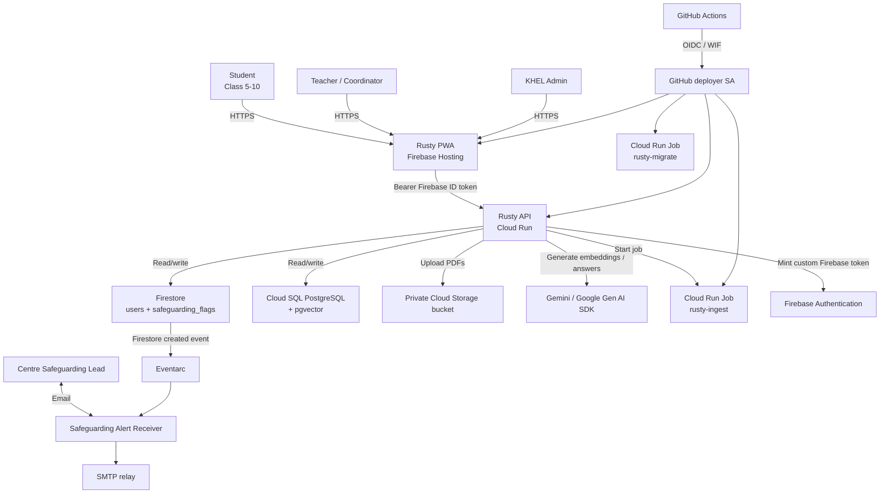

# Rusty on Google Cloud - Deployment Plan

> **Purpose:** Code-agent implementation plan for deploying Rusty AI Study Mentor to Google Cloud.
>
> **Source:** Converted from `Rusty-GCP-Plan.pdf` (24 pages; source document identified inside the PDF as `GCP_DEPLOYMENT_PLAN.md`).
>
> **Review date:** 2026-10-04
>
> **Status:** The original plan was reviewed against current Google Cloud documentation and corrected below. **Do not treat the original PDF's prices, model-retirement warning, or production Cloud SQL tier as authoritative.**
>
> **Scope:** Staging + production, up to 500 KHEL students on Bihar Board curriculum, with roughly 150 students active at peak.
>
> **Repository reconciliation:** 2026-10-04 against commit `a784b98` (`main`). See **Section 0A** for what the code does today and **Section 0** for the step-by-step prerequisites. Where this plan and `CLAUDE.md` disagree, `CLAUDE.md` security non-negotiables win.

---

## 0. Prerequisites - step by step (start here)

Work through the phases in order. Do not start Phase 5 (provisioning) until Phases 0-4 are complete. Each step has an owner and a "done when" check.

### Phase 0 - Decisions that block everything (KHEL leadership + tech lead)

| # | Step | Owner | Done when |
|---|---|---|---|
| 0.1 | Decide AI data-residency option: **A** (`gemini-3.1-flash-lite`, `global`) or **B** (`gemini-3.5-flash`, `asia-south1`). See Section 5. | KHEL leadership | Decision written to `doc/data-residency-decision.md` and committed. |
| 0.2 | Confirm the query-text logging policy: `CLAUDE.md` says query text **is** logged (admin-only) for safeguarding oversight; Section 7 of the original plan said never log it. Pick one and record it. | KHEL safeguarding lead | Recorded in the same decision file. |
| 0.3 | Name the safeguarding alert recipient(s) (role mailbox, not a personal address). | KHEL safeguarding lead | Address(es) known. |
| 0.4 | Choose an SMTP relay (e.g. Google Workspace SMTP relay, SendGrid, Mailgun) and get host/port/username/password. | Tech lead | Test email sent from a laptop with those credentials. |
| 0.5 | Approve the monthly budget ceiling (plan default: $150) and who receives budget alerts. | KHEL finance | Amount + recipients agreed. |
| 0.6 | Choose project IDs, e.g. `rusty-staging-khel` and `rusty-prod-khel` (globally unique, cannot be changed later). | Tech lead | `gcloud projects describe <id>` returns "not found" (ID is free). |
| 0.7 | Decide frontend domain: default `<project>.web.app` or a custom KHEL domain. | Tech lead | Decision recorded; DNS access confirmed if custom. |

### Phase 1 - Accounts and access

1. **Google account for the tech lead** with 2-Step Verification enabled (use a KHEL-owned account, not personal).
2. **Cloud Billing account** created at <https://console.cloud.google.com/billing> with a valid payment profile (India billing requires PAN/GST details for business accounts). Note the `XXXXXX-XXXXXX-XXXXXX` billing account ID.
3. **(Recommended) Google Cloud organization** via Google Workspace or Cloud Identity for KHEL, with a `rusty` folder holding staging and production. Without an org, projects are owned by the individual account - add a second owner so access is not a single point of failure.
4. **Operator IAM** - the person provisioning needs, at minimum: `roles/resourcemanager.projectCreator` (org/folder), `roles/billing.user` on the billing account, and `roles/owner` on the two new projects (reduce after setup).
5. **GitHub** - admin access to the `Rusty-AI-Study-Mentor` repository (needed to create `staging` / `production` Environments, reviewers and variables). Note the exact `<owner>/<repo>` string for Workload Identity Federation (Section 17.2).
6. **Firebase console** access with the same Google account (<https://console.firebase.google.com>).

### Phase 2 - Workstation tools

Either use **Cloud Shell** (all tools preinstalled; recommended for provisioning) or install locally on Windows:

| Tool | Version | Check |
|---|---|---|
| Google Cloud CLI (`gcloud`) | latest | `gcloud version` then `gcloud auth login` and `gcloud auth application-default login` |
| Firebase CLI | latest | `npm i -g firebase-tools` then `firebase login` |
| Docker Desktop (WSL2 backend) | latest | `docker run hello-world` - **or** skip Docker and build with `gcloud builds submit` |
| Git | latest | **Enable symlinks** (`git config core.symlinks true`, Developer Mode on Windows) - the repo currently relies on symlinks, see blocker B1 |
| Python | 3.11 (matches Dockerfile + CI) | `python --version` |
| Node.js | 20 (matches CI) | `node --version` |
| OpenSSL | any (bundled with Git Bash / Cloud Shell) | `openssl version` |

### Phase 3 - Code blockers (must be fixed before the first staging deploy)

These are verified gaps in the current code (detail in Section 0A). They are ordered by dependency - fix top to bottom.

| # | Blocker | Where | Why it blocks deployment |
|---|---|---|---|
| B1 | Docker build is broken: `COPY ../rag/` is invalid (cannot copy outside build context) and `backend/rag`, `backend/safeguarding` are git symlinks. | [backend/Dockerfile](../backend/Dockerfile) | Image either fails to build or ships without `rag/` and `safeguarding/` - app refuses to start without the phrases file. Build from repo root with `-f backend/Dockerfile .` and `COPY rag/ safeguarding/` explicitly. |
| B2 | `pymupdf` (`import fitz`) is missing from `requirements.txt`. | [rag/ingestion/pdf_extractor.py](../rag/ingestion/pdf_extractor.py), [backend/requirements.txt](../backend/requirements.txt) | Ingestion crashes in the container. |
| B3 | Gemini calls use removed `vertexai.generative_models` / `vertexai.language_models` from `google-cloud-aiplatform==1.53.0`. | [rag/retrieval/llm_client.py](../rag/retrieval/llm_client.py), [rag/retrieval/gemini_client.py](../rag/retrieval/gemini_client.py) | Hard blocker (I3). Replace with `google-genai` client wrapper. |
| B4 | Config defaults are stale: `vertex_ai_location="us-central1"`, `gemini_model="gemini-2.5-flash-lite"`, `vertex_embed_model="text-multilingual-embedding-002"`. Embeddings don't pass task types. | [backend/app/core/config.py](../backend/app/core/config.py) | Wrong model/region. Switch to `gemini-embedding-001`, `output_dimensionality=1024`, `RETRIEVAL_DOCUMENT` / `RETRIEVAL_QUERY`. |
| B5 | Ingestion + chapter summaries are hard-wired to Ollama (`embed_batch_ollama`, summary generator posts to `/api/chat`). | [rag/ingestion/pipeline.py](../rag/ingestion/pipeline.py), [rag/ingestion/embedder.py](../rag/ingestion/embedder.py), [rag/ingestion/summary_generator.py](../rag/ingestion/summary_generator.py), [backend/app/api/admin.py](../backend/app/api/admin.py) | No Ollama on Cloud Run - ingestion fails. Route through the `llm_client` provider abstraction. |
| B6 | Ingestion runs as a FastAPI `BackgroundTask` from a local temp file. No Cloud Storage upload, no `rag.ingestion.job` module (only `cli.py`). | [backend/app/api/admin.py](../backend/app/api/admin.py), [rag/ingestion/cli.py](../rag/ingestion/cli.py) | Cloud Run throttles CPU after the response and instances can be recycled - ingestion silently dies. Upload to GCS, then execute Cloud Run Job `rusty-ingest`. |
| B7 | App calls `Base.metadata.create_all` on startup; `textbooks`, `chapter_summaries`, `rag_traces` have **no Alembic migration**. | [backend/app/main.py](../backend/app/main.py), [backend/migrations/versions/](../backend/migrations/versions/) | A fresh Cloud SQL DB migrated with `alembic upgrade head` is missing three tables; `create_all` at startup races across instances. Add migration `0004`, remove `create_all`. |
| B8 | Frontend sends the **custom token** as the Bearer token; backend `verify_id_token` will reject it. Firebase JS SDK is installed but never used. | [frontend/src/components/auth/LoginScreen.tsx](../frontend/src/components/auth/LoginScreen.tsx), [backend/app/core/deps.py](../backend/app/core/deps.py) | Every authenticated call returns 401 outside development. Add `signInWithCustomToken()` + `getIdToken()` (with refresh). |
| B9 | Safeguarding flags are never written: `tier1_flag_and_alert` exists but no route calls it; email is a log-only stub. | [backend/app/middleware/safeguarding.py](../backend/app/middleware/safeguarding.py), [backend/app/api/study.py](../backend/app/api/study.py) | Violates the CLAUDE.md non-negotiable; nothing for Eventarc to trigger on. |
| B10 | Streaming answers and cache hits are **not** output-scanned (`retrieve_streaming` / cache path have no `tier1_scan`). | [backend/app/services/retrieval.py](../backend/app/services/retrieval.py) | Violates "never return an LLM response without the output scan". `/study/query/stream` is the main path used by the frontend. |
| B11 | Admin user-management endpoints the frontend calls do not exist: `/admin/users`, `/admin/next-user-id`, `/admin/onboard`, `/admin/reset-pin`, `/admin/offboard`. | [frontend/src/api/index.ts](../frontend/src/api/index.ts), [backend/app/api/admin.py](../backend/app/api/admin.py) | No way to onboard students in production (dev uses hard-coded credentials). Implement them, or ship a bootstrap script (Section 19.2). |
| B12 | DB pool is hard-coded `pool_size=10, max_overflow=20` (x2 workers x4 instances = 240 connections). | [backend/app/core/database.py](../backend/app/core/database.py) | Exceeds Cloud SQL connection limit for `db-custom-1-3840`. Externalise as `DB_POOL_SIZE` / `DB_MAX_OVERFLOW`. |
| B13 | `/ready` always returns HTTP 200 (computed `status_code` is unused). | [backend/app/api/health.py](../backend/app/api/health.py) | Health checks/uptime monitoring can't detect a broken DB. |
| B14 | PWA caches `/study`, `/test`, `/admin` responses (`NetworkFirst`, 24 h); KaTeX CSS loads from jsDelivr but CSP only allows `'self'` + Google. | [frontend/vite.config.ts](../frontend/vite.config.ts), [frontend/src/components/shared/MathRenderer.tsx](../frontend/src/components/shared/MathRenderer.tsx), [frontend/index.html](../frontend/index.html) | Child data cached on shared devices; maths rendering broken in prod. Also add the Cloud Run origin to `connect-src`. |
| B15 | No `firebase.json` hosting / `firestore` sections, no `firestore.rules`, no `.firebaserc`. | [firebase.json](../firebase.json) | `firebase deploy --only hosting,firestore:rules` has nothing to deploy. |

Also fix before production (not before first staging deploy): rate limiter and login lockout are in-memory per worker and keyed by IP ([backend/app/core/limiter.py](../backend/app/core/limiter.py), [backend/app/api/auth.py](../backend/app/api/auth.py)); `test` schemas return `correct_option` - confirm it is never sent before an answer is submitted; Firestore `users` docs are keyed by raw student ID.

**Done when:** all B1-B15 merged, `pytest` and `npm test` green in CI, and `docker build -f backend/Dockerfile .` from repo root produces an image that starts with `APP_ENV=staging` locally.

### Phase 4 - Cloud readiness checks (after projects exist, before provisioning the rest)

1. Confirm the chosen Gemini model is callable in the chosen location from the project (Vertex AI Studio or a one-off `google-genai` script).
2. Confirm `gemini-embedding-001` returns 1024-dim vectors with `output_dimensionality=1024`.
3. Review Vertex AI / Gemini quotas (requests per minute) in **IAM & Admin -> Quotas**; set a conservative cap (Section 6.3).
4. Confirm Cloud SQL, Firestore, Cloud Storage and Artifact Registry are offered in `asia-south1` for the project (no org policy blocking the region: check `constraints/gcp.resourceLocations`).

### Phase 5 - Content and data

1. Collect final Bihar Board textbook PDFs per class (5-10) and subject, under 50 MB each (current upload limit).
2. **Plan to re-ingest every PDF in each cloud environment.** Local embeddings (`snowflake-arctic-embed2`) and cloud embeddings (`gemini-embedding-001`) are different vector spaces - never copy the local `chunks` table to Cloud SQL.
3. Prepare the student roster CSV: student ID, class, centre, role only - no names, ages or contact details (CLAUDE.md).
4. Prepare PIN slip printing/distribution process (Section 19.2).

### Phase 6 - Provisioning order (staging first)

Only now follow Sections 11-17 in this order, in the **staging** project:

```text
11.2 variables -> 11.3 project/APIs/budget -> 11.4 Artifact Registry -> 11.5 service accounts
-> 11.6 Cloud SQL (staging: db-f1-micro) -> 11.7 secrets -> 11.8 Firestore
-> 11.9 Firebase -> 11.10 bucket -> 11.11 build/push -> 12.2 migrate job -> 12.3 ingest job
-> 12.4 alert receiver + Eventarc -> 13 API -> 14 frontend -> 15 log exclusions -> 16 monitoring
-> 17 GitHub WIF -> 18 go-live gates
```

Repeat for production only after every Section 18 gate passes in staging.

---

## 0A. Repository reconciliation (code state at commit `a784b98`)

| Plan assumption | Current code | Status |
|---|---|---|
| Backend entry point | `backend/app/main.py` (FastAPI, gunicorn + 2 uvicorn workers, port 8080) | OK |
| Non-root container user `rusty` | `backend/Dockerfile` creates and uses `rusty` | OK |
| Dockerfile built from repo root | Built from `backend/`; uses invalid `COPY ../rag/`; relies on symlinks | **Blocker B1** |
| `APP_ENV` gates dev tokens / dev credentials | `deps.py` and `auth.py` only allow dev tokens when `app_env == "development"` | OK - ensure prod sets `APP_ENV=production` |
| Production CORS wildcard forbidden | `config.cors_origins` raises on `*` in production | OK |
| Docs/OpenAPI disabled in prod | `main.py` disables when `is_production` | OK |
| Tier-1 input scan | `/study/query`, `/study/query/stream`, `/test/generate`, `/quiz/generate` scan input | OK |
| Tier-1 output scan | Non-streaming `/study/query`, test, quiz scanned; **streaming + cache hits + summaries not scanned** | **Blocker B10** |
| Firestore safeguarding flag + alert | Function exists, never called; email stub | **Blocker B9** |
| `google-genai` SDK | `google-cloud-aiplatform==1.53.0` with removed namespaces | **Blocker B3** |
| `gemini-embedding-001` @ 1024 | `text-multilingual-embedding-002` default; `vector(1024)` column (migration 0003) | **Blocker B4** |
| PDF -> GCS -> Cloud Run Job | Local temp file + `BackgroundTasks`; Ollama-only ingestion | **Blockers B5, B6** |
| Alembic is the only schema source | `create_all` on startup; 3 tables missing from migrations | **Blocker B7** |
| Browser exchanges custom token for ID token | Custom token used directly as Bearer | **Blocker B8** |
| Config env vars `GOOGLE_CLOUD_*`, `TEXTBOOK_BUCKET`, `INGEST_JOB_NAME`, `DB_POOL_*`, `SMTP_*` | Not defined in `Settings`; Pydantic ignores unknown env vars silently | Add to `config.py` with the code changes |
| Rate limit per authenticated student | `slowapi` keyed by remote IP, in-memory | Fix before production |
| GitHub Actions CI | `ci.yml` runs secret scan, pytest, pip-audit, npm audit/test/build; **no deploy job** | Add deploy workflow (Section 17) |
| Firebase Hosting / rules config | `firebase.json` has emulators only | **Blocker B15** |
| Safeguarding alert receiver service | Does not exist (no `functions/` or alert service) | Build new (Section 12.4) |
| Eval harness | `backend/eval/run_eval.py` + `maths08_squares.json` | OK - run from `backend/` |

---

## 1. Executive decision

Use a managed/serverless Google Cloud architecture:

- **Region for regional application/data resources:** `asia-south1` (Mumbai).
- **API:** Cloud Run service `rusty-api`.
- **Frontend:** Firebase Hosting for React PWA.
- **Relational/vector data:** Cloud SQL for PostgreSQL 16 + `pgvector`.
- **Users and safeguarding flags:** Cloud Firestore Native mode + Firebase Authentication custom-token flow.
- **PDFs:** private Cloud Storage bucket.
- **PDF ingestion:** Cloud Run Job.
- **Migrations:** Cloud Run Job using Alembic.
- **Safeguarding alerts:** Firestore event -> Eventarc -> dedicated authenticated alert receiver (prefer Cloud Run service; use Cloud Run function/gen2 only if the repository already implements that runtime).
- **LLM:** Google Gen AI SDK (`google-genai`) against the Google Cloud/Gemini Enterprise Agent Platform endpoint.
- **Embeddings:** `gemini-embedding-001`, explicitly configured to the database vector dimension.
- **CI/CD:** GitHub Actions + Workload Identity Federation. No service-account key files.

### Non-negotiable residency statement

Do **not** say "everything that stores data sits in Mumbai." The corrected statement is:

> Primary Rusty application data stores are placed in `asia-south1` where supported. Firebase Hosting is global/CDN-based; Firebase Authentication and some Google Cloud control-plane/observability services have their own location behavior. A global Gemini endpoint can process prompts outside India. Therefore, India-only processing/storage must be evaluated service-by-service and must not be inferred from the GCP project region alone.

For the cost-oriented AI option (`gemini-3.1-flash-lite` at the global endpoint), the plan explicitly accepts global processing. Do not describe that option as India-resident.

---

## 2. Important issues found in the original plan - already addressed

### I1. Production Cloud SQL used `db-g1-small` - fixed

**Original:** production Cloud SQL was configured as `db-g1-small`.

**Problem:** Google documents `db-f1-micro` and `db-g1-small` as shared-core machine types intended for low-cost test/development use and not included in the Cloud SQL SLA. They should not be the production database tier.

**Correction:** production Cloud SQL uses a dedicated-core tier. Start with:

```bash
db-custom-1-3840
```

This is 1 vCPU / 3.75 GiB RAM. Re-size after load testing. Staging may continue to use `db-f1-micro` because staging is non-production.

### I2. The model-retirement warning is stale - fixed

The PDF says the configured model retires on 20 October 2026. The current Google Cloud documentation lists the stable `gemini-3.1-flash-lite` model as GA with retirement **May 7, 2027 or later**. The old retirement warning referred to the previous `gemini-2.5-flash-lite` choice, not the current stable 3.1 model.

The code still must not hard-code an unverified model. Model availability must be validated during deployment.

### I3. `vertexai.generative_models` is already removed from post-June-2026 Vertex AI SDKs - fixed

The original plan correctly identified the migration, but the code-agent plan must treat it as a **hard requirement**, not a future cleanup item.

Required change:

- remove imports/usages of `vertexai.generative_models` and related deprecated generative namespaces;
- use `google-genai`;
- use an explicit `genai.Client(..., enterprise=True, project=..., location=...)` or the equivalent current Google-supported configuration;
- do not rely on process-global `vertexai.init()` for Gemini calls.

### I4. Embedding dimension must be explicit - fixed

`gemini-embedding-001` produces 3072 dimensions by default and supports configurable output dimensionality. The Rusty database is designed around `vector(1024)`, so the application **must explicitly request `output_dimensionality=1024` for both document and query embeddings** and use compatible task types.

Use:

- textbook/chunk embedding: `RETRIEVAL_DOCUMENT`
- student-question embedding: `RETRIEVAL_QUERY`

Never mix dimensions or embedding models inside the same vector column.

### I5. Safeguarding alert component existed in diagrams but had no deployment path - fixed

The original architecture contains a "Safeguarding Alert" Cloud Run function and an Eventarc trigger, but the provisioning steps did not actually deploy the function/service or create the trigger.

**Correction:** the deployment plan now has an explicit safeguarding alert deployment stage and validation gate. Use a dedicated alert receiver and Eventarc direct Firestore event trigger. The code agent must inspect the repository first and reuse any existing handler rather than inventing a second implementation.

### I6. SMTP secret was referenced but never created - fixed

The original plan references `SMTP` / SMTP password in Secret Manager but only creates `DATABASE_URL` and `SECRET_KEY`.

**Correction:** create a dedicated secret for the SMTP password (and any API token if the relay uses one). Keep host/port/from address as non-secret configuration unless the provider requires otherwise.

### I7. `roles/run.jobsExecutorWithOverrides` was broader than necessary - fixed

The API only needs to start the ingestion job. Use:

```text
roles/run.jobsExecutor
```

instead of `roles/run.jobsExecutorWithOverrides` unless the application actually needs runtime overrides.

### I8. "Let the API sleep at night" conflicted with `min-instances=1` - fixed

The original plan simultaneously kept one Cloud Run instance warm and proposed turning the API off at night.

**Correction:**

- production: use `min-instances=1` only when the latency benefit is worth the idle cost;
- staging: use `min-instances=0`;
- do not claim a production "sleep at night" saving unless an explicit scheduled operational mechanism is implemented.

### I9. The original `$110/month` estimate is no longer valid as a production target - fixed

Changing Cloud SQL from shared-core `db-g1-small` to dedicated-core `db-custom-1-3840` materially changes the fixed-cost baseline. Keep the **$150 monthly budget alert as a guardrail**, but recalculate expected cost in the Google Cloud Pricing Calculator before production approval.

The original AI token assumptions and Cloud Run estimate can remain as workload inputs, not as committed prices.

### I10. Global Gemini processing must be described as a residency exception - fixed

A global Google Cloud API endpoint does not provide regional isolation/data-residency guarantees. Therefore the plan now treats `global` Gemini as an explicit policy decision.

If KHEL requires India-only AI processing, select a model/endpoint supported in `asia-south1` and accept its higher cost, or obtain a written compliance decision that permits the global option.

### I11. Secret Manager location was unspecified - fixed

Because the plan discusses data location, create production secrets with user-managed regional replication in `asia-south1` rather than leaving replication behavior implicit.

### I12. Rollback/restore instructions needed stronger separation between application rollback and database recovery - fixed

Cloud Run revision rollback does not roll back a database schema or data. Database recovery is a separate operation. The plan now requires:

- backward-compatible migrations;
- restore rehearsal in staging;
- explicit point-in-time recovery procedure;
- no automatic production redirection to a restored clone until the clone has been validated.

### I13. Firebase Authentication is not the same thing as a Mumbai-resident data store - clarified

The Firebase Authentication service is part of the identity path but its data-location behavior is not controlled simply by placing the GCP project in `asia-south1`.

If KHEL has a strict India-only data-processing requirement, this must be checked separately with the relevant Firebase/Google contractual and compliance documentation.

### I14. Cloud SQL "IAM connector only" wording was too strong - clarified

The intended connectivity is Cloud Run -> Cloud SQL integration/Auth Proxy over the `/cloudsql/...` Unix socket. Cloud SQL can have a public IP endpoint while direct client access is still controlled by IAM/connector authorization. Do not describe it as "private IP only" when the deployment does not create a VPC/private-IP path.

### I15. Two projects must have their own complete configuration - clarified

`staging` and `production` are separate projects, so the following are project-specific and must not be shared accidentally:

- project ID
- Firebase project registration
- Firestore database
- Cloud SQL instance
- Storage bucket
- Artifact Registry repository
- service accounts
- secrets
- Eventarc trigger
- monitoring/alerting
- API allowed origins

---

## 3. Architecture

### 3.1 System context



### 3.2 Runtime components

| Component | Service | Region / location | Purpose |
|---|---|---|---|
| React PWA | Firebase Hosting | Global | Static web app/CDN |
| API | Cloud Run `rusty-api` | `asia-south1` | Auth, RAG, tests, dashboards, SSE |
| SQL | Cloud SQL `rusty-db` | `asia-south1` | Relational data + pgvector |
| Firestore | `(default)` Native | `asia-south1` | Users, flags, small control documents |
| Textbooks | Cloud Storage | `asia-south1` | Original PDF files |
| Ingestion | Cloud Run Job `rusty-ingest` | `asia-south1` | Parse PDFs, chunk, embed, summarize |
| Migration | Cloud Run Job `rusty-migrate` | `asia-south1` | Alembic migrations |
| Alerts | Cloud Run `rusty-alert` + Eventarc | `asia-south1` | Email safeguarding flags |
| Images | Artifact Registry `rusty` | `asia-south1` | Private container images |
| Secrets | Secret Manager | Prefer regional replication `asia-south1` | DB URL, app key, SMTP secret |
| LLM/embeddings | Gemini via Google Cloud | See model/endpoint decision | Generation + embeddings |

---

## 4. Decisions

| ID | Decision | Choice | Implementation rule |
|---|---|---|---|
| D1 | Region | `asia-south1` | Use for all regional Rusty resources unless a service/model constraint prevents it. |
| D2 | Backend | Cloud Run | Public HTTPS endpoint; application validates Firebase ID tokens on every protected request. |
| D3 | Frontend | Firebase Hosting | Use default Hosting domains or a configured custom domain. |
| D4 | Database | Cloud SQL PostgreSQL 16 + pgvector | **Production must use dedicated-core**, starting at `db-custom-1-3840`. |
| D5 | Users & flags | Firestore + Firebase Auth | Backend-only Firestore access; custom-token sign-in; no client Firestore reads/writes. |
| D6 | PDF ingestion | Cloud Run Job | No long-running background task inside an HTTP request handler. |
| D7 | LLM | Configurable Gemini model | Default cost path: `gemini-3.1-flash-lite` at `global`; India-resident path: `gemini-3.5-flash` in `asia-south1`. Verify current model availability at deploy time. |
| D8 | Embeddings | `gemini-embedding-001` | Explicitly request 1024 dimensions; use matching query/document task types. |
| D9 | Networking | No VPC initially | Cloud Run -> Cloud SQL via Cloud SQL integration/Auth Proxy Unix socket. Revisit private networking only when required by scale/compliance. |
| D10 | Environments | Two projects | Separate staging and production projects and Firebase registrations. |
| D11 | Deploys | GitHub Actions + Workload Identity Federation | No JSON service-account keys in GitHub. |
| D12 | Safeguarding eventing | Eventarc direct Firestore trigger | Trigger on creation of `safeguarding_flags` documents. |
| D13 | Logging | Minimize application logs + exclude Cloud Run request logs if policy requires | Never log student ID, raw IP, prompt, answer, PIN, secrets, or auth tokens. |

---

## 5. AI processing decision (KHEL leadership gate)

There are two materially different compliance/cost choices.

### Option A - cost-first

- Model: `gemini-3.1-flash-lite`
- Location: `global`
- GA; current Google Cloud docs list retirement May 7, 2027 or later.
- Best for low-latency, high-volume traffic.
- **Not an India-only processing option.** Global endpoints do not provide regional isolation/data residency guarantees.

### Option B - India processing

- Model: `gemini-3.5-flash`
- Location: `asia-south1`
- Current Google Cloud docs list `asia-south1` as a supported location and retirement May 19, 2027 or later.
- Higher model cost; use only if KHEL requires India processing or wants the stronger model.

### Decision gate

Before any production traffic:

1. KHEL confirms whether pseudonymous study prompts from minors may be processed outside India.
2. Record the decision in a repository file such as `docs/data-residency-decision.md`.
3. Keep the model and location configurable through environment variables.
4. Add a deployment-time smoke test that verifies the selected model is available in the selected endpoint.

---

## 6. Cost model and guardrails

### 6.1 Do not use the original fixed-cost headline as a commitment

The original PDF quoted roughly `$110/month` typical use. That estimate depended on the shared-core `db-g1-small` production tier and is therefore obsolete for the corrected production design.

Use these rules instead:

- Keep a **$150 monthly budget alert** as the initial safety ceiling.
- Recalculate the expected cost in the Google Cloud Pricing Calculator before go-live.
- Treat Vertex/Gemini usage as the primary variable cost.
- Use the daily per-student caps to make runaway LLM costs impossible under normal operation.
- Set a conservative Vertex/Gemini quota in addition to a billing budget. Budgets alert; quota constrains usage.

### 6.2 Original workload assumptions retained as planning inputs

- Up to 500 students.
- Roughly 150 active students/day at peak.
- 6 questions/student/day.
- 0.5 practice tests/student/day.
- 26 school days/month.
- Roughly 3,500 input tokens/question.
- Roughly 800 output tokens/answer.
- Roughly 2,500 input tokens/test, subject to actual implementation.

### 6.3 Cost controls

1. Per-student daily caps, initially around 40 questions + 5 tests.
2. Server-side cache for repeated questions.
3. Lowest acceptable thinking level per mode.
4. Tight output-token limits.
5. LLM quota ceiling.
6. Budget alerts at 50%, 90%, and 100%.
7. Staging uses `min-instances=0` and the smallest acceptable non-production database.
8. Do not use production Cloud SQL shared-core machines to save money.

---

## 7. Security and privacy rules

These are release-blocking requirements, not optional improvements.

### Authentication

- Student sign-in: student ID + PIN over HTTPS.
- Backend checks the Firestore user record.
- PIN hashes use bcrypt.
- Add rate limiting and lockout.
- Firebase providers remain disabled; use custom tokens only.
- The browser exchanges the custom token for a Firebase ID token.
- Every protected API call verifies the Firebase ID token and checks revocation as required.
- Do not expose a development token or dev-admin token in production.

### PIN security

A 6-digit PIN has low entropy. Keep online rate limiting/lockout mandatory and require a PIN change on first use. Prefer a longer PIN or passcode when KHEL's operational process allows it.

### Data minimization

Do not store:

- names unless there is a documented operational requirement;
- age/date of birth;
- parent/guardian contact details;
- raw IP address in application data;
- raw PIN;
- authentication tokens;
- full chat history on the server unless separately approved.

Student ID is an identifier and is still personal data even when names are omitted. Use an opaque internal UID for Firebase where practical, and keep student-ID mapping narrowly scoped.

### Safeguarding

Every user question and AI answer must be scanned according to the repository safeguarding policy.

A blocked message must:

1. return the agreed HTTP status (`451` in the original plan);
2. create a Firestore safeguarding flag;
3. include flag ID, centre and timestamp in the alert path;
4. never be deletable by the application;
5. produce an operational alert;
6. be covered by automated tests including false positives such as `grape`.

### Logging

> **Conflict with `CLAUDE.md` - resolve in Prerequisite 0.2.** `CLAUDE.md` records an explicit decision that query text **is** logged for child-safeguarding oversight (admin-only). The code stores it in `rag_traces.query_text` (Cloud SQL, TTL-purged) and exposes it via `/admin/rag/recent`. The list below applies to **Cloud Logging / stdout** output; query text in the admin-only `rag_traces` table is governed by the recorded decision.

Never log raw (to Cloud Logging):

- question text;
- answer text;
- student ID;
- IP address;
- PIN;
- Firebase ID token;
- custom token;
- database password;
- SMTP password;
- secret values.

Use structured application events with opaque IDs where operationally necessary.

---

## 8. Production resource configuration

### 8.1 Cloud Run API

Target configuration:

- service: `rusty-api`
- region: `asia-south1`
- CPU: 1 vCPU
- memory: 1 GiB
- concurrency: 40 starting point
- min instances: 1 only if low-latency startup is required
- max instances: 4 starting point
- timeout: 120 seconds
- startup CPU boost: enabled
- unauthenticated service endpoint: enabled at the platform layer, because the application performs Firebase-token authorization

The application, not Cloud Run IAM, is the auth boundary for student API requests.

### 8.2 Cloud SQL

Production starting point:

- PostgreSQL 16
- Enterprise edition
- dedicated machine `db-custom-1-3840`
- region `asia-south1`
- zonal availability initially
- 10 GiB SSD starting size, auto-increase enabled
- automated backups enabled
- 7 retained backups
- PITR enabled
- 7 days transaction-log retention for Enterprise edition
- deletion protection enabled
- per-instance Google-managed internal CA mode where compatible with the chosen connection path

Do not hard-code an assumed maximum connection count. After creation, query/verify the actual instance limits and configure the SQLAlchemy/asyncpg pool so the worst-case connection count stays comfortably below the real limit.

For the original 4-instance / 2-worker model, `DB_POOL_SIZE=3` and `DB_MAX_OVERFLOW=2` gives a maximum of 5 connections per worker, or about 40 across 4 instances x 2 workers. Keep this as a **starting configuration**, not a guarantee.

### 8.3 Firestore

- Native mode.
- database `(default)`.
- region `asia-south1`.
- delete protection enabled.
- PITR enabled.
- weekly backups, 14-week retention.
- browser access denied by Firestore Security Rules.

### 8.4 Cloud Storage

- one private regional bucket per environment;
- location `asia-south1`;
- uniform bucket-level access;
- public access prevention enforced;
- API service account: object creator only;
- ingestion service account: object viewer only;
- use unique object names / IDs to avoid update/delete permission problems.

### 8.5 Artifact Registry

- Docker repository `rusty` in `asia-south1`;
- cleanup policy: keep the 10 most recent versions, subject to your rollback retention needs.

### 8.6 Secret Manager

Required secrets:

- `DATABASE_URL`
- `SECRET_KEY`
- `SMTP_PASSWORD`

Use regional/user-managed replication in `asia-south1` for data-location-sensitive production secrets.

---

## 9. Environment configuration

Use environment variables that clearly separate application configuration from Google SDK configuration.

> **Current code:** [backend/app/core/config.py](../backend/app/core/config.py) defines only `APP_ENV`, `SECRET_KEY`, `DATABASE_URL`, `FIREBASE_*`, `LLM_PROVIDER`, `OLLAMA_*`, `VERTEX_AI_PROJECT`, `VERTEX_AI_LOCATION`, `GEMINI_MODEL`, `VERTEX_EMBED_MODEL`, `EMBED_DIM`, `SAFEGUARDING_ALERT_EMAIL`, `PHRASES_FILE_PATH`, `ALLOWED_ORIGINS`. Pydantic settings silently ignore unknown variables, so `GOOGLE_CLOUD_*`, `TEXTBOOK_BUCKET`, `INGEST_JOB_NAME`, `DB_POOL_SIZE`, `DB_MAX_OVERFLOW` and `SMTP_*` below have **no effect until added to `Settings`** (blockers B3, B6, B9, B12). `FIREBASE_AUTH_EMULATOR_HOST` and `FIRESTORE_EMULATOR_HOST` must be **unset** in Cloud Run.

```text
APP_ENV=production
LLM_PROVIDER=vertex

# Google Gen AI SDK canonical values
GOOGLE_CLOUD_PROJECT=<PROJECT_ID>
GOOGLE_CLOUD_LOCATION=global
GOOGLE_GENAI_USE_ENTERPRISE=true

# Rusty application settings
VERTEX_AI_PROJECT=<PROJECT_ID>
VERTEX_AI_LOCATION=global
VERTEX_EMBED_MODEL=gemini-embedding-001
EMBED_DIM=1024

FIREBASE_PROJECT_ID=<PROJECT_ID>
ALLOWED_ORIGINS=https://<PROJECT_ID>.web.app,https://<PROJECT_ID>.firebaseapp.com
TEXTBOOK_BUCKET=<PROJECT_ID>-textbooks
INGEST_JOB_NAME=rusty-ingest
SAFEGUARDING_ALERT_EMAIL=<KHEL ALERT ADDRESS>
PHRASES_FILE_PATH=./safeguarding/phrases_v1.json
DB_POOL_SIZE=3
DB_MAX_OVERFLOW=2

SMTP_HOST=<relay host>
SMTP_PORT=<relay port>
SMTP_USERNAME=<relay user>
SMTP_FROM=<sender address>
```

Recommended actual value:

```text
GEMINI_MODEL=gemini-3.1-flash-lite
```

For the India-processing option:

```text
GOOGLE_CLOUD_LOCATION=asia-south1
VERTEX_AI_LOCATION=asia-south1
GEMINI_MODEL=gemini-3.5-flash
```

The code agent must make the Google Gen AI client explicit rather than relying on deprecated Vertex AI global initialization.

---

## 10. Code changes required before deployment

> Cross-reference: the items below map to the verified blockers in **Section 0, Phase 3** (B1-B15), which give file locations. Items already satisfied by the current code are marked `[x]`.

### A. Safeguarding

- [ ] Scan AI output on streaming result, cache hits and chapter summaries. (B10 - non-streaming `/study/query`, test and quiz already scan output)
- [ ] Write a Firestore flag on every blocked message. (B9 - `tier1_flag_and_alert` exists but is never called)
- [ ] Implement alert receiver and email path. (B9 / Section 12.4)
- [ ] Use whole-word matching and remove over-broad phrases. (`tier1_scan` currently uses substring `in` matching)
- [ ] Expand safeguarding tests to at least 100 cases, including false positives.

### B. GCP deployment blockers

- [ ] Remove macOS-only symlinks from the build path. (B1 - `backend/rag`, `backend/safeguarding`)
- [ ] Build the image from repository root. (B1 - fix `COPY ../rag/`)
- [ ] Add `pymupdf` - ingestion does use PyMuPDF (`import fitz`). (B2)
- [ ] Add `google-genai`. (B3)
- [ ] Remove all deprecated `vertexai.generative_models` / `vertexai.language_models` imports/usages; delete or migrate the unused `rag/retrieval/gemini_client.py`. (B3)
- [ ] Use a shared Google Gen AI client wrapper for generation and embeddings - extend the existing `rag/retrieval/llm_client.py` provider switch. (B3)
- [ ] Configure `gemini-3.1-flash-lite` by default and keep model/location configurable. (B4)
- [ ] Use `gemini-embedding-001` with explicit output dimensionality 1024. (B4)
- [ ] Use `RETRIEVAL_DOCUMENT` for textbook chunks and `RETRIEVAL_QUERY` for questions. (B4)
- [ ] Route ingestion embeddings and chapter-summary generation through the provider abstraction (currently Ollama-only). (B5)
- [ ] Frontend exchanges backend custom token for Firebase ID token and sends that ID token to API. (B8)
- [ ] Add Alembic migration for `textbooks`, `chapter_summaries`, `rag_traces`; remove `create_all()` from startup. (B7)
- [ ] Move PDF upload to Cloud Storage. (B6)
- [ ] Add `rag/ingestion/job.py` entry point and start ingestion through Cloud Run Job execution. (B6)
- [ ] Make DB pool configuration externalized. (B12)
- [ ] Make `/ready` return 503 when degraded. (B13)
- [ ] Add Firebase Hosting + Firestore rules config. (B15)
- [ ] Rate-limit per authenticated student; do not use IP-only limiting. Move lockout state out of process memory (Firestore or Memorystore).
- [ ] Refuse production startup when `APP_ENV != production`.
- [x] Ensure the production image runs as non-root user `rusty`. (Dockerfile already does this)

### C. Usable pilot

- [ ] Provide a real student onboarding mechanism or a documented bootstrap script. (B11 - frontend already calls `/admin/users`, `/admin/onboard`, `/admin/next-user-id`, `/admin/reset-pin`, `/admin/offboard`; backend has none of them)
- [ ] Store published-test attempts on server.
- [ ] Do not send answer keys to the browser.
- [ ] Populate teacher dashboard from server-side attempt data.
- [ ] Enforce one answer per question per attempt.
- [ ] Restrict students to their own class.
- [ ] Disable PWA caching of authenticated study/test/admin responses. (B14 - `vite.config.ts` `api-cache` rule)
- [ ] Bundle KaTeX CSS locally. (B14 - currently jsDelivr, blocked by CSP)
- [ ] Apply daily question/test caps.

---

## 11. Cloud Shell setup - staging first, then production

All commands below are intended for Cloud Shell unless explicitly stated otherwise.

### 11.1 Operator prerequisites

- Google account for technical lead.
- 2-step verification enabled.
- Billing account available.
- For organizations, put staging/prod under the KHEL Google Cloud organization/folders when available.
- Confirm required IAM permissions to create projects, enable APIs, grant roles, and create databases.

### 11.2 Variables

Use a separate shell session/config per environment.

```bash
export PROJECT_ID="rusty-prod-khel"      # globally unique
export REGION="asia-south1"
export BILLING_ACCOUNT="XXXXXX-XXXXXX-XXXXXX"
export ALERT_EMAIL="safeguarding-lead@example.org"
export API_SA="rusty-api@${PROJECT_ID}.iam.gserviceaccount.com"
export JOBS_SA="rusty-jobs@${PROJECT_ID}.iam.gserviceaccount.com"
export DEPLOYER_SA="github-deployer@${PROJECT_ID}.iam.gserviceaccount.com"
export ALERT_SA="rusty-alert@${PROJECT_ID}.iam.gserviceaccount.com"
export EVENTARC_SA="rusty-eventarc@${PROJECT_ID}.iam.gserviceaccount.com"
export IMAGE="${REGION}-docker.pkg.dev/${PROJECT_ID}/rusty/api"
export SQL_CONN="${PROJECT_ID}:${REGION}:rusty-db"
export BUCKET="${PROJECT_ID}-textbooks"
```

### 11.3 Project, APIs and budget

```bash
gcloud projects create "$PROJECT_ID" --name="Rusty Prod"
gcloud billing projects link "$PROJECT_ID" --billing-account="$BILLING_ACCOUNT"
gcloud config set project "$PROJECT_ID"

gcloud services enable \
  run.googleapis.com \
  sqladmin.googleapis.com \
  artifactregistry.googleapis.com \
  secretmanager.googleapis.com \
  aiplatform.googleapis.com \
  firestore.googleapis.com \
  storage.googleapis.com \
  iam.googleapis.com \
  iamcredentials.googleapis.com \
  sts.googleapis.com \
  cloudbuild.googleapis.com \
  firebase.googleapis.com \
  firebasehosting.googleapis.com \
  identitytoolkit.googleapis.com \
  eventarc.googleapis.com \
  eventarcpublishing.googleapis.com \
  cloudfunctions.googleapis.com \
  monitoring.googleapis.com \
  logging.googleapis.com \
  billingbudgets.googleapis.com

gcloud billing budgets create \
  --billing-account="$BILLING_ACCOUNT" \
  --display-name="rusty-prod monthly" \
  --budget-amount=150USD \
  --filter-projects="projects/${PROJECT_ID}" \
  --threshold-rule=percent=0.5 \
  --threshold-rule=percent=0.9 \
  --threshold-rule=percent=1.0
```

The budget is an alert/visibility control, not a hard usage stop.

### 11.4 Artifact Registry

```bash
gcloud artifacts repositories create rusty \
  --repository-format=docker \
  --location="$REGION" \
  --description="Rusty container images"
```

Configure a cleanup policy to retain the 10 most recent versions, while keeping enough images for a safe rollback window.

### 11.5 Service accounts

```bash
gcloud iam service-accounts create rusty-api --display-name="Rusty API runtime"
gcloud iam service-accounts create rusty-jobs --display-name="Rusty jobs runtime"
gcloud iam service-accounts create rusty-alert --display-name="Rusty safeguarding alert runtime"
gcloud iam service-accounts create rusty-eventarc --display-name="Rusty Eventarc trigger"
gcloud iam service-accounts create github-deployer --display-name="GitHub Actions deployer"
```

#### API runtime roles

Grant only the roles actually needed by the current code. Starting set from the original plan:

```text
roles/cloudsql.client
roles/datastore.user
roles/aiplatform.user
roles/firebaseauth.viewer
roles/logging.logWriter
roles/monitoring.metricWriter
```

The code agent must remove any role that is not required after inspecting the code.

#### Job runtime roles

Start with:

```text
roles/cloudsql.client
roles/aiplatform.user
roles/logging.logWriter
```

Add `roles/storage.objectViewer` **on the textbook bucket** (resource-level grant), not project-wide.

#### Safeguarding alert runtime roles

If the dedicated `rusty-alert` service reads `safeguarding_flags` and sends email, start with:

```text
roles/datastore.user
roles/logging.logWriter
```

Grant `roles/secretmanager.secretAccessor` on `SMTP_PASSWORD` at the secret level. The alert service should not
receive Cloud SQL or Vertex AI permissions unless the actual implementation requires them.

#### API service account can mint Firebase custom tokens

```bash
gcloud iam service-accounts add-iam-policy-binding "$API_SA" \
  --member="serviceAccount:${API_SA}" \
  --role="roles/iam.serviceAccountTokenCreator"
```

Do not create or download a service-account JSON key for this purpose.

### 11.6 Cloud SQL production

```bash
gcloud sql instances create rusty-db \
  --database-version=POSTGRES_16 \
  --edition=ENTERPRISE \
  --tier=db-custom-1-3840 \
  --region="$REGION" \
  --availability-type=zonal \
  --storage-type=SSD \
  --storage-size=10 \
  --storage-auto-increase \
  --backup-start-time=20:30 \
  --retained-backups-count=7 \
  --retained-transaction-log-days=7 \
  --enable-point-in-time-recovery \
  --maintenance-window-day=SUN \
  --maintenance-window-hour=21 \
  --deletion-protection

gcloud sql databases create rusty --instance=rusty-db

DB_PASS="$(openssl rand -base64 40 | tr -d '/+=' | cut -c1-32)"
gcloud sql users create rusty_app --instance=rusty-db --password="$DB_PASS"
```

Staging: same command with `--tier=db-f1-micro`, `--retained-backups-count=3` and without `--deletion-protection` if you want easy teardown.

Extensions: migration `0001_initial_schema.py` runs `CREATE EXTENSION IF NOT EXISTS vector`, `"uuid-ossp"` and `pg_trgm`. Users created with `gcloud sql users create` get `cloudsqlsuperuser`, which can create these, so no manual step is needed - but confirm the migration job logs show them created.

Then store the DB URL without printing the secret:

```bash
printf 'postgresql+asyncpg://rusty_app:%s@/rusty?host=/cloudsql/%s' "$DB_PASS" "$SQL_CONN" \
  | gcloud secrets create DATABASE_URL \
      --replication-policy=user-managed \
      --locations="$REGION" \
      --data-file=-
```

### 11.7 Secret Manager

```bash
openssl rand -hex 32 | tr -d '\n' \
  | gcloud secrets create SECRET_KEY \
      --replication-policy=user-managed \
      --locations="$REGION" \
      --data-file=-

# Create the secret metadata only. Add the first version from a secure input channel
# (Secret Manager console or another approved secret-management process). Never commit
# or paste the SMTP password into this plan or into shell history.
gcloud secrets create SMTP_PASSWORD \
  --replication-policy=user-managed \
  --locations="$REGION"

for S in DATABASE_URL SECRET_KEY; do
  gcloud secrets add-iam-policy-binding "$S" \
    --member="serviceAccount:${API_SA}" \
    --role="roles/secretmanager.secretAccessor"
done

gcloud secrets add-iam-policy-binding DATABASE_URL \
  --member="serviceAccount:${JOBS_SA}" \
  --role="roles/secretmanager.secretAccessor"
```

Grant `roles/secretmanager.secretAccessor` on `SMTP_PASSWORD` only to the component that actually sends email.
Do not grant the API access merely because the architecture contains SMTP. If the existing code sends email from
the API, keep the binding there until the alert sender is refactored; otherwise bind it only to `ALERT_SA`.

### 11.8 Firestore

```bash
gcloud firestore databases create \
  --location="$REGION" \
  --type=firestore-native \
  --delete-protection \
  --enable-pitr

gcloud firestore backups schedules create \
  --database='(default)' \
  --recurrence=weekly \
  --day-of-week=SUN \
  --retention=14w
```

### 11.9 Firebase

In the Firebase console:

1. Add the existing GCP project to Firebase.
2. Enable Authentication.
3. Leave sign-in providers disabled except the custom-token mechanism used by the application.
4. Keep only required Hosting/authorized domains.
5. Register the Rusty web app.
6. Put the public Firebase web configuration into the GitHub Actions environment/variables used for the build.
7. Restrict the browser API key by HTTP referrers/authorized domains and the required APIs.
8. Commit restrictive Firestore rules.

`firestore.rules`:

```text
rules_version = '2';
service cloud.firestore {
  match /databases/{database}/documents {
    match /{document=**} {
      allow read, write: if false;
    }
  }
}
```

Deploy rules:

```bash
firebase use "$PROJECT_ID"
firebase deploy --only firestore:rules
```

### 11.10 Textbook bucket

```bash
gcloud storage buckets create "gs://${BUCKET}" \
  --location="$REGION" \
  --uniform-bucket-level-access \
  --public-access-prevention

gcloud storage buckets add-iam-policy-binding "gs://${BUCKET}" \
  --member="serviceAccount:${API_SA}" \
  --role="roles/storage.objectCreator"

gcloud storage buckets add-iam-policy-binding "gs://${BUCKET}" \
  --member="serviceAccount:${JOBS_SA}" \
  --role="roles/storage.objectViewer"
```

### 11.11 Build and push

```bash
git clone <your-repo-url> rusty
cd rusty
gcloud auth configure-docker "${REGION}-docker.pkg.dev" --quiet
TAG="$(git rev-parse --short HEAD)"
docker build -f backend/Dockerfile -t "${IMAGE}:${TAG}" .
docker push "${IMAGE}:${TAG}"
```

The code agent must first verify that the Dockerfile path, build context, symlinks and runtime command actually match the repository.

> **Current code:** this command fails until blocker B1 is fixed - the Dockerfile expects `backend/` as context (`COPY requirements.txt`, `COPY app/`) and contains an invalid `COPY ../rag/`. After the fix, paths must be `backend/requirements.txt`, `backend/app/`, `backend/migrations/`, `backend/alembic.ini`, `rag/`, `safeguarding/`. The Alembic job (12.2) runs from `WORKDIR /app`, so `alembic.ini` must sit there. No local Docker? Use `gcloud builds submit --tag "${IMAGE}:${TAG}" --config` with a `cloudbuild.yaml` that passes `-f backend/Dockerfile`.

---

## 12. Runtime jobs

### 12.1 Shared environment

Construct the common environment from the repository's actual configuration names. Recommended baseline:

```bash
COMMON_ENV="^|^APP_ENV=production|LLM_PROVIDER=vertex|GOOGLE_CLOUD_PROJECT=${PROJECT_ID}|GOOGLE_CLOUD_LOCATION=global|GOOGLE_GENAI_USE_ENTERPRISE=true|VERTEX_AI_PROJECT=${PROJECT_ID}|VERTEX_AI_LOCATION=global|GEMINI_MODEL=gemini-3.1-flash-lite|VERTEX_EMBED_MODEL=gemini-embedding-001|EMBED_DIM=1024|FIREBASE_PROJECT_ID=${PROJECT_ID}|SAFEGUARDING_ALERT_EMAIL=${ALERT_EMAIL}|PHRASES_FILE_PATH=./safeguarding/phrases_v1.json|TEXTBOOK_BUCKET=${BUCKET}|DB_POOL_SIZE=3|DB_MAX_OVERFLOW=2"
```

The `^|^` syntax tells `gcloud` to split on `|` so commas inside values are safe.

### 12.2 Migration job

```bash
gcloud run jobs create rusty-migrate \
  --image="${IMAGE}:${TAG}" \
  --region="$REGION" \
  --service-account="$JOBS_SA" \
  --set-cloudsql-instances="$SQL_CONN" \
  --set-secrets="DATABASE_URL=DATABASE_URL:latest" \
  --set-env-vars="$COMMON_ENV|SECRET_KEY=unused-by-migrations" \
  --command="alembic" \
  --args="upgrade,head" \
  --task-timeout=10m \
  --max-retries=0

gcloud run jobs execute rusty-migrate --region="$REGION" --wait
```

Migration rules:

- migration must succeed while the previous release is still serving;
- never use `create_all()` in production startup;
- expand/contract schema changes when required;
- verify migration against a production-like staging database before production.

### 12.3 Ingestion job

```bash
gcloud run jobs create rusty-ingest \
  --image="${IMAGE}:${TAG}" \
  --region="$REGION" \
  --service-account="$JOBS_SA" \
  --set-cloudsql-instances="$SQL_CONN" \
  --set-secrets="DATABASE_URL=DATABASE_URL:latest" \
  --set-env-vars="$COMMON_ENV|SECRET_KEY=unused-by-jobs" \
  --command="python" \
  --args="-m,rag.ingestion.job" \
  --cpu=2 \
  --memory=4Gi \
  --task-timeout=60m \
  --max-retries=1

gcloud run jobs add-iam-policy-binding rusty-ingest \
  --region="$REGION" \
  --member="serviceAccount:${API_SA}" \
  --role="roles/run.jobsExecutor"
```

The API should start this job only after the PDF upload succeeds. The ingestion job must be idempotent for retries.

> **Current code:** `rag.ingestion.job` does not exist yet - only `rag/ingestion/cli.py` (local, Ollama, file-path based). Create `job.py` that reads the GCS object + textbook ID from job arguments/env overrides, downloads to `/tmp`, calls `ingest_pdf` and `generate_chapter_summaries` via the provider abstraction, and updates `textbooks.status`. `ingest_pdf` already deletes existing chunks for the same `source_pdf` before insert, which helps idempotency. If the job needs per-execution arguments (which PDF), the API needs `roles/run.jobsExecutorWithOverrides` after all - or pass the textbook ID via a Firestore/SQL "pending" row and keep `roles/run.jobsExecutor`.

### 12.4 Safeguarding alert receiver - required missing stage

The repository must expose a dedicated HTTP handler for safeguarding events, for example as:

```text
POST /
Content-Type: application/cloudevents+json (or Eventarc-supported encoding)
```

The receiver must:

1. accept only Eventarc-authenticated invocations;
2. validate the event type/source and Firestore collection;
3. extract the flag ID and event timestamp;
4. read any required flag details from Firestore rather than trusting arbitrary user-supplied fields;
5. send an email using the SMTP secret;
6. be idempotent so duplicate event delivery does not produce uncontrolled duplicate emails;
7. write an operational structured log using only the flag ID / centre / event type / status.

Prefer a separate Cloud Run service `rusty-alert` in `asia-south1` if the repo already supports HTTP container deployment. Route the direct Firestore creation event through Eventarc:

```bash
# Example trigger shape; exact event filters/path patterns must be matched to the repository schema.
gcloud eventarc triggers create safeguarding-flag-created \
  --location="$REGION" \
  --destination-run-service=rusty-alert \
  --destination-run-region="$REGION" \
  --event-filters="type=google.cloud.firestore.document.v1.created" \
  --event-filters="database=(default)" \
  --event-filters-path-pattern="document=safeguarding_flags/{flagId}" \
  --event-data-content-type="application/protobuf" \
  --service-account="${EVENTARC_SA}"
```

Grant the trigger service account permission to invoke the alert service before creating the trigger:

```bash
gcloud run services add-iam-policy-binding rusty-alert \
  --region="$REGION" \
  --member="serviceAccount:${EVENTARC_SA}" \
  --role="roles/run.invoker"
```

The trigger service account must also be permitted to receive the Firestore event according to Eventarc's current
service-agent/IAM requirements. Keep those grants scoped to this project and resource where possible.

The `rusty-alert` service itself must be deployed before the trigger is created. Use the repository's actual alert
entry point and the `ALERT_SA` service account, keep the service private (`--no-allow-unauthenticated`), and grant
only the Eventarc trigger identity `roles/run.invoker`. Do not create a second alert implementation if the repo already
has a gen2 Cloud Run function that can be wired directly to the Firestore event.

If the repository instead contains a Cloud Run function/gen2 entry point, deploy that existing function implementation and wire its Firestore direct-event trigger; do not maintain two alert implementations.

---

## 13. Deploy the API

```bash
gcloud run deploy rusty-api \
  --image="${IMAGE}:${TAG}" \
  --region="$REGION" \
  --service-account="$API_SA" \
  --add-cloudsql-instances="$SQL_CONN" \
  --set-secrets="DATABASE_URL=DATABASE_URL:latest,SECRET_KEY=SECRET_KEY:latest" \
  --set-env-vars="$COMMON_ENV|INGEST_JOB_NAME=rusty-ingest|ALLOWED_ORIGINS=https://${PROJECT_ID}.web.app,https://${PROJECT_ID}.firebaseapp.com|SMTP_HOST=<relay host>|SMTP_PORT=<relay port>|SMTP_USERNAME=<relay user>|SMTP_FROM=<sender address>" \
  --cpu=1 \
  --memory=1Gi \
  --concurrency=40 \
  --min-instances=1 \
  --max-instances=4 \
  --timeout=120 \
  --cpu-boost \
  --allow-unauthenticated
```

Then check:

```bash
API_URL="$(gcloud run services describe rusty-api --region="$REGION" --format='value(status.url)')"
curl -fsS "$API_URL/health"
curl -fsS "$API_URL/ready"
```

`/health` must not depend on the database or external providers if the intent is simple process health. `/ready` may depend on critical runtime dependencies.

---

## 14. Frontend deployment

Build the frontend with the API URL and Firebase public configuration.

```bash
cd frontend
npm ci

VITE_API_URL="$API_URL" \
VITE_FIREBASE_API_KEY="<public browser key>" \
VITE_FIREBASE_AUTH_DOMAIN="${PROJECT_ID}.firebaseapp.com" \
VITE_FIREBASE_PROJECT_ID="$PROJECT_ID" \
VITE_FIREBASE_APP_ID="<firebase app id>" \
npm run build

cd ..
firebase use "$PROJECT_ID"
firebase deploy --only hosting
```

Before deployment ensure the CSP includes the exact Cloud Run API origin and Firebase Authentication origins required by the browser flow.

Do not cache authenticated API responses, study/test/admin payloads, Firebase ID tokens, or PIN reset responses in the service worker.

---

## 15. Cloud Run request-log privacy

Cloud Run request logs are automatically generated. If KHEL policy requires platform request logs that contain client IP addresses to be excluded from the default log bucket, use Cloud Logging exclusions.

Example:

```bash
gcloud logging sinks update _Default \
  --add-exclusion="name=exclude-run-request-logs,filter=logName=\"projects/${PROJECT_ID}/logs/run.googleapis.com%2Frequests\""
```

Then verify the policy actually has the desired effect in Logs Explorer.

Important:

- this does **not** erase information from logs that have already been exported elsewhere;
- audit the complete logging architecture, including any aggregated sinks;
- do not rely on this step as the only privacy control;
- application logs must already avoid raw PII.

---

## 16. Monitoring and alerts

Configure in each environment.

### Availability

- HTTPS uptime check to `GET /health` every 5 minutes.
- Alert the technical lead when repeated failures occur.

### Safeguarding

Create log-based metrics for:

```text
jsonPayload.event="safeguarding_tier1_triggered"
```

and

```text
jsonPayload.event="circuit_breaker_tripped"
```

Alert the safeguarding lead and technical lead on every safeguarding trigger.

### Resource alerts

Starting thresholds:

- Cloud Run 5xx > 5% for 10 minutes.
- Cloud SQL CPU > 80% for 15 minutes.
- Cloud SQL disk > 80%.
- Database connections approaching the tested safe limit.
- Budget 50%, 90%, 100%.

Do not use an arbitrary fixed "more than 40 connections" alert after changing the Cloud SQL production tier. Base the threshold on the actual instance configuration and pool budget.

---

## 17. GitHub Actions / Workload Identity Federation

### 17.1 One-time deployer setup

```bash
DEPLOYER="github-deployer@${PROJECT_ID}.iam.gserviceaccount.com"

for ROLE in roles/run.developer roles/artifactregistry.writer roles/firebasehosting.admin; do
  gcloud projects add-iam-policy-binding "$PROJECT_ID" \
    --member="serviceAccount:${DEPLOYER}" \
    --role="$ROLE"
done

for SA in "$API_SA" "$JOBS_SA" "$ALERT_SA"; do
  gcloud iam service-accounts add-iam-policy-binding "$SA" \
    --member="serviceAccount:${DEPLOYER}" \
    --role="roles/iam.serviceAccountUser"
done
```

The Cloud Run deployment documentation requires the deployer to have Cloud Run Developer, Artifact Registry Reader on the image repository, and Service Account User on the service identity. Because the example deployer has Artifact Registry Writer, it also has the needed repository read capability; keep the narrower Reader role if the deployer does not need to push images directly.

### 17.2 GitHub OIDC trust

```bash
gcloud iam workload-identity-pools create github \
  --location=global \
  --display-name="GitHub"

gcloud iam workload-identity-pools providers create-oidc github-provider \
  --location=global \
  --workload-identity-pool=github \
  --issuer-uri="https://token.actions.githubusercontent.com" \
  --attribute-mapping="google.subject=assertion.sub,attribute.repository=assertion.repository,attribute.ref=assertion.ref" \
  --attribute-condition="assertion.repository=='<github-owner>/Rusty-AI-Study-Mentor'"

PROJECT_NUMBER="$(gcloud projects describe "$PROJECT_ID" --format='value(projectNumber)')"

gcloud iam service-accounts add-iam-policy-binding "$DEPLOYER" \
  --role="roles/iam.workloadIdentityUser" \
  --member="principalSet://iam.googleapis.com/projects/${PROJECT_NUMBER}/locations/global/workloadIdentityPools/github/attribute.repository/<github-owner>/Rusty-AI-Study-Mentor"
```

GitHub workflow requirements:

- `id-token: write` permission;
- `google-github-actions/auth` with the Workload Identity Provider;
- no service-account JSON secret;
- production deployment environment requires an approval/reviewer;
- staging and production use different project IDs and Firebase config;
- deployment uses immutable commit-SHA image tags.

### 17.3 Release sequence

```text
1. CI checks
2. Build one image from repository root
3. Push image tagged with commit SHA
4. Run migration job against target environment
5. Deploy/update ingestion job
6. Deploy API
7. Build/deploy Firebase Hosting
8. Verify health/readiness
9. Run smoke/evaluation tests
10. Promote/approve production only after staging passes
```

Migration compatibility rule:

> The new schema must work while the previous application revision is still serving until traffic is shifted.

---

## 18. Go-live gates

All gates must pass in staging before production.

### Application

- [ ] `GET /health` returns 200.
- [ ] `GET /ready` returns 200 when dependencies are healthy.
- [ ] Student login succeeds with student ID + PIN.
- [ ] Firebase ID token is sent on protected API calls.
- [ ] Revoked/expired ID tokens fail.
- [ ] Development token is rejected in production.

### RAG

- [ ] Textbook upload creates the expected bucket object.
- [ ] Ingestion job completes successfully.
- [ ] Chunks have the expected semantic structure.
- [ ] Document embeddings are 1024-dimensional.
- [ ] Query embeddings are 1024-dimensional.
- [ ] Query/document task types are correct.
- [ ] RAG retrieval is filtered by class and subject.
- [ ] Answers are grounded in textbook passages.

### Safeguarding

- [ ] A test phrase returns `451`.
- [ ] A Firestore safeguarding flag is created.
- [ ] Alert receiver processes the event.
- [ ] Email is sent to the safeguarding lead.
- [ ] Log-based alert fires.
- [ ] Duplicate event delivery does not cause uncontrolled duplicate emails.
- [ ] False-positive test such as `grape` is allowed.

### Data and backup

- [ ] One staging Cloud SQL restore has been rehearsed.
- [ ] Firestore PITR is enabled.
- [ ] Firestore backup schedule exists.
- [ ] Cloud SQL deletion protection is enabled.
- [ ] Secrets use the intended replication policy.
- [ ] Production database is dedicated-core.

### Privacy

- [ ] No raw IP addresses in application logs.
- [ ] No student IDs in application logs unless explicitly justified.
- [ ] No names/age/contact data collected by default.
- [ ] No auth tokens in logs.
- [ ] Service worker does not cache authenticated payloads.
- [ ] Global AI processing decision documented.

### Operations

- [ ] Budget emails received.
- [ ] Safeguarding alert reaches both operational and technical recipients.
- [ ] Cloud Run 5xx alert tested.
- [ ] Cloud SQL threshold alerts configured.
- [ ] Production rollback procedure tested for API revision.
- [ ] Database rollback/recovery procedure is documented separately.

### Evaluation

Run:

```bash
cd backend
python -m eval.run_eval --base-url "$API_URL"
```

(The eval harness lives in `backend/eval/`; current dataset is `maths08_squares.json`. Confirm `run_eval.py` accepts `--base-url` and a real Firebase ID token for staging, since dev tokens are rejected outside `development`.)

The original plan required at least 10 of 11 evaluation cases. Keep that threshold only if it is still the project's agreed acceptance criterion; otherwise store the current criterion in the repository and enforce it in CI.

---

## 19. Daily operations

### 19.1 Roll back a bad Cloud Run release

```bash
gcloud run revisions list --service=rusty-api --region="$REGION"
gcloud run services update-traffic rusty-api \
  --region="$REGION" \
  --to-revisions=<previous-revision>=100
```

For Firebase Hosting, use the Firebase rollback mechanism appropriate to the current CLI release.

**Database warning:** this does not undo schema/data changes. Fix forward where possible; use point-in-time recovery only when data integrity requires it.

### 19.2 Student onboarding

1. Prepare a CSV with student ID, class, centre and role; do not include names unless explicitly required.
2. Run the approved bootstrap script as an authorized tech lead.
3. Generate a random temporary PIN.
4. Store only the bcrypt hash in Firestore.
5. Mark the account to require PIN change on first login.
6. Print/distribute PIN slips securely.
7. Delete the temporary plaintext PIN file after distribution.

### 19.3 Safeguarding incident

1. Centre lead follows KHEL safeguarding policy.
2. Alert email supplies the flag ID and minimum required context.
3. Designated administrator reads the flag from Firestore.
4. Flag is never deleted by the application.
5. Resolution is recorded with resolver ID/time/status.

### 19.4 Database restore

The exact timestamp and clone name must be supplied at the time of incident. Example pattern:

```bash
gcloud sql instances clone rusty-db rusty-db-restore \
  --point-in-time="<RFC3339 timestamp>"
```

Then:

1. Validate the clone in isolation.
2. Do not immediately repoint production.
3. If the clone is accepted, create a controlled replacement/restore plan.
4. Update the production `DATABASE_URL` secret only through an approved change process.
5. Redeploy and run health/readiness checks.
6. Document the incident and recovery point.

### 19.5 When to scale

| Symptom | Response |
|---|---|
| Cloud SQL CPU > 70-80% persistently | Load-test and move beyond `db-custom-1-3840` if required. |
| Frequent 429s / all API instances busy | Increase Cloud Run max instances only after revisiting DB pool/connection capacity. |
| >1,000 students or many centres | Reassess HA database, shared rate limiting, background task queue, and tenancy/isolation. |
| Need custom API domain / WAF | Add the required front-door architecture (for example external HTTPS load balancer + Cloud Armor) after documenting its cost and operational impact. |
| Manual setup becomes repetitive | Convert the verified configuration to Terraform under `infra/`. |

---

## 20. Data flows - login and study query

### Login

```text
PWA
  -> POST /auth/login (student ID + PIN)
  -> Cloud Run API
  -> Firestore read users/{student_id}
  -> bcrypt verification + lockout/rate limit
  -> Firebase custom token with role/class claims
  -> browser signInWithCustomToken()
  -> Firebase ID token
```

### Study question

```text
PWA
  -> POST /study/query/stream with Bearer ID token
  -> Cloud Run API
  -> verify Firebase ID token + revocation
  -> safeguard scan question + selected client history
  -> if blocked: 451 + Firestore flag + alert event
  -> embed query with gemini-embedding-001 / 1024 dims / RETRIEVAL_QUERY
  -> Cloud SQL cache + vector search + keyword search, constrained by class/subject
  -> Gemini generates answer from retrieved passages
  -> safeguard scan generated answer
  -> ground-check answer
  -> stream final answer + stage events
```

Do not persist complete conversation history on the server unless a separately approved product requirement exists.

---

## 21. Code-agent instructions

The code agent consuming this file must follow these rules.

### 21.1 Repository-first rule

Before editing infrastructure or application code:

1. inspect the repository structure;
2. locate the actual backend entry point, Dockerfile, migrations, ingestion module, Firebase config and safeguarding implementation;
3. locate existing environment/configuration names;
4. reuse existing abstractions where possible;
5. do not invent file paths unless the repository does not already contain an equivalent.

### 21.2 No blind GCP provisioning

The code agent must not provision production resources immediately.

Order:

```text
inspect -> patch code -> run tests -> build image -> deploy staging -> run smoke tests -> restore rehearsal -> production approval
```

### 21.3 Preserve local development

Do not break the existing localhost development flow. GCP configuration must be additive and environment-specific.

### 21.4 Avoid black-box cloud coupling

Application logic must remain portable. Keep provider-specific integrations behind small adapters where practical:

- Firebase Auth adapter
- Google Gen AI adapter
- Cloud Storage adapter
- Cloud Run Job executor adapter
- Firestore safeguarding event adapter

### 21.5 Test requirements

At minimum:

- unit tests for auth, PIN lockout and safeguarding;
- integration tests for PostgreSQL + pgvector;
- integration test for Google Gen AI client configuration;
- ingestion job test;
- Eventarc/safeguarding handler test;
- frontend auth flow test;
- end-to-end test for login -> study question -> streamed answer;
- regression tests for cache hits and blocked messages;
- migration upgrade test from the previous release schema.

### 21.6 Secrets

Never commit:

- GCP service-account keys;
- SMTP passwords;
- database passwords;
- production `SECRET_KEY`;
- Firebase auth tokens.

Public Firebase web config values can be built into the frontend, but browser API keys must still be restricted by domain/API where supported.

### 21.7 Model configuration

The code agent must support at least:

```text
GEMINI_MODEL
GOOGLE_CLOUD_PROJECT
GOOGLE_CLOUD_LOCATION
GOOGLE_GENAI_USE_ENTERPRISE
VERTEX_EMBED_MODEL
EMBED_DIM
```

Model clients must be initialized in a way compatible with the current Google Gen AI SDK and must not depend on removed `vertexai.generative_models` imports.

---

## 22. Source-to-correction traceability

The original PDF's major choices are retained here, but the following specific corrections were made:

| Original topic | Original direction | Corrected direction |
|---|---|---|
| Cloud SQL production tier | `db-g1-small` | `db-custom-1-3840` starting point; dedicated core |
| AI model retirement | 2.5 Flash-Lite retirement warning | stable 3.1 Flash-Lite is current default; verify model at deployment |
| Gemini SDK | migration required | hard blocker: use `google-genai` |
| Embeddings | 1024-dim | explicit 1024 output dimensionality for document/query vectors |
| Safeguarding alert | diagrammed but not provisioned | explicit receiver + Eventarc deployment stage |
| SMTP | referenced in secrets list | `SMTP_PASSWORD` secret explicitly provisioned; grant access only to actual mail sender |
| Ingestion executor role | `roles/run.jobsExecutorWithOverrides` | `roles/run.jobsExecutor` unless overrides are truly used |
| Cloud Run cost-saving sleep | min 1 + sleep suggestion | staging min 0; production min 1 only when justified |
| Residency statement | all data in Mumbai | service-by-service location statement |
| Secrets location | implicit | regional/user-managed replication preferred |
| Connection count | fixed 50 assumption | derive from actual DB tier/config and pool budget |
| Rollback | revision rollback + restore | explicit app rollback vs DB recovery separation |

---

## 23. Verified Google Cloud references

Use the official documentation below when a CLI flag or service behavior changes. The code agent should prefer these over old snippets in the source PDF.

### Gemini / Google Gen AI

- Gemini 3.1 Flash-Lite: https://docs.cloud.google.com/gemini-enterprise-agent-platform/models/gemini/3-1-flash-lite
- Gemini 3.5 Flash: https://docs.cloud.google.com/gemini-enterprise-agent-platform/models/gemini/3-5-flash
- Google Gen AI SDK overview: https://docs.cloud.google.com/gemini-enterprise-agent-platform/models/sdks/overview
- Vertex AI SDK migration: https://docs.cloud.google.com/gemini-enterprise-agent-platform/machine-learning/python-sdk/sdk-migration
- Text embeddings / dimensions: https://docs.cloud.google.com/gemini-enterprise-agent-platform/models/embeddings/get-text-embeddings
- Global vs regional endpoint behavior: https://docs.cloud.google.com/docs/security/compliance/endpoints

### Cloud SQL / Cloud Run

- Cloud SQL PostgreSQL instance settings: https://docs.cloud.google.com/sql/docs/postgres/instance-settings
- Cloud SQL from Cloud Run: https://docs.cloud.google.com/sql/docs/postgres/connect-run
- Cloud SQL Auth Proxy / IAM: https://docs.cloud.google.com/sql/docs/postgres/connect-auth-proxy
- Cloud SQL PITR: https://docs.cloud.google.com/sql/docs/postgres/backup-recovery/configure-pitr
- Cloud SQL create CLI: https://docs.cloud.google.com/sdk/gcloud/reference/sql/instances/create
- Cloud SQL quotas/limits: https://docs.cloud.google.com/sql/docs/postgres/quotas
- Cloud Run service identity: https://docs.cloud.google.com/run/docs/securing/service-identity
- Cloud Run IAM roles: https://docs.cloud.google.com/run/docs/reference/iam/roles
- Cloud Run logging: https://docs.cloud.google.com/run/docs/logging

### Firestore / Storage / Eventarc / Firebase

- Firestore locations: https://docs.cloud.google.com/firestore/docs/locations
- Firestore database create: https://docs.cloud.google.com/sdk/gcloud/reference/firestore/databases/create
- Firestore backup schedules: https://docs.cloud.google.com/sdk/gcloud/reference/firestore/backups/schedules/create
- Cloud Storage locations: https://docs.cloud.google.com/storage/docs/locations
- Cloud Storage bucket creation: https://docs.cloud.google.com/sdk/gcloud/reference/storage/buckets/create
- Eventarc Firestore -> Cloud Run: https://docs.cloud.google.com/eventarc/standard/docs/run/route-trigger-cloud-firestore
- Firebase Hosting deploy: https://firebase.google.com/docs/hosting/quickstart
- Firebase custom tokens: https://firebase.google.com/docs/auth/admin/create-custom-tokens
- Firebase Hosting IAM: https://docs.cloud.google.com/iam/docs/roles-permissions/firebasehosting

---

## 24. Final acceptance statement

This plan is **implementation-ready as an architectural/deployment specification**, but the code agent must still reconcile it with the actual Rusty repository before making code changes.

The original PDF is not treated as authoritative where current Google Cloud documentation or internal consistency exposed a problem. In particular, **do not deploy production with `db-g1-small`, do not use `vertexai.generative_models`, do not claim all data is Mumbai-resident, and do not omit the safeguarding alert deployment path.**

### Release status checklist

- [ ] KHEL AI data-residency decision recorded.
- [x] Repository inspection completed (2026-10-04, commit `a784b98` - see Section 0A).
- [ ] Prerequisite Phases 0-5 (Section 0) completed.
- [ ] Code blockers A/B/C completed.
- [ ] Staging project provisioned.
- [ ] Staging deployment succeeds.
- [ ] Staging safeguarding flow tested.
- [ ] Staging DB restore rehearsed.
- [ ] Cost recalculated.
- [ ] Production approval obtained.
- [ ] Production provisioned from the same verified configuration.

